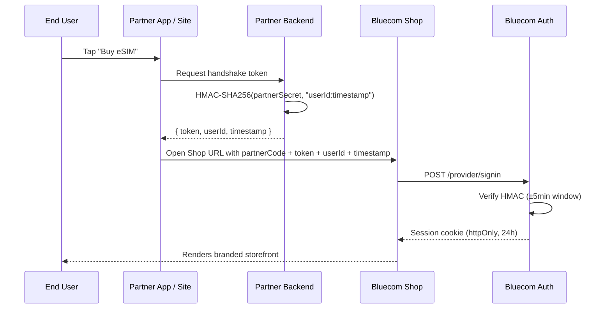

# Architecture

The Shop boots from a signed URL. The partner's **backend** holds the secret and signs the handshake; the partner's **app/frontend** never sees the secret.

## Trust boundary

| Component | Holds secret? | Talks to |
|-----------|---------------|----------|
| Partner backend | **Yes** | Partner app only |
| Partner app/frontend | No | Partner backend, Shop URL |
| Bluecom Shop (browser/webview) | No | Bluecom Auth |
| Bluecom Auth | Verifies HMAC | Internal |

See [Authentication](../integration/authentication.md) for the full token contract.
