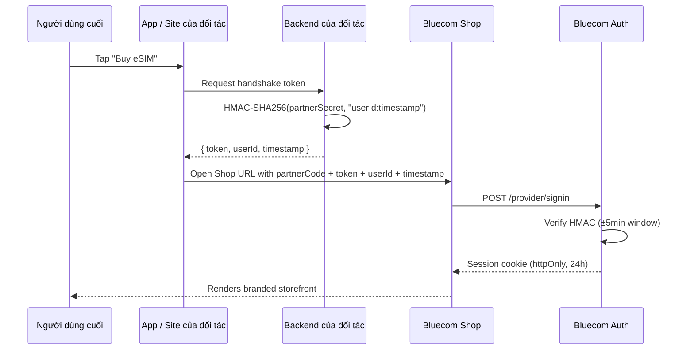

# Kiến trúc

Shop được khởi tạo từ một URL đã ký. **Backend** của đối tác giữ secret và ký bắt tay (handshake); **app/frontend** của đối tác không bao giờ thấy secret.

## Ranh giới tin cậy

| Thành phần | Giữ secret? | Giao tiếp với |
|-----------|---------------|----------|
| Backend của đối tác | **Có** | Chỉ app của đối tác |
| App/frontend của đối tác | Không | Backend của đối tác, URL của Shop |
| Bluecom Shop (browser/webview) | Không | Bluecom Auth |
| Bluecom Auth | Xác thực HMAC | Nội bộ |

Xem [Authentication](../integration/authentication.md) để biết hợp đồng token đầy đủ.
