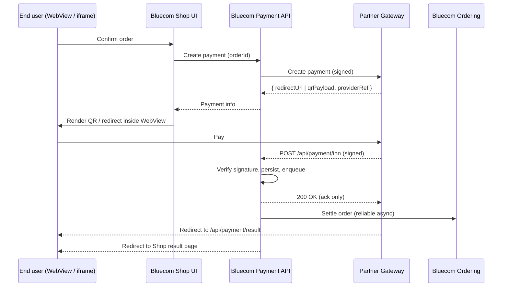

# Architecture

Bluecom integrates third-party payment gateways through a **single payment-service abstraction** in the platform. Your gateway is one implementation behind that contract — the rest of the platform (Ordering, Shop UI, Hub, reconciliation) does not change per provider. New providers reuse the same endpoints, signing pipeline, audit store, and reconciliation jobs.

## High-level flow

Two independent channels carry the result:

| Channel | Role | Trustworthiness |
|---------|------|-----------------|
| **IPN (server-to-server)** | Source of truth for order state transitions. | Authoritative. |
| **Browser redirect** (`/api/payment/result`) | UX only — moves the user back to the Shop. | Never used to settle an order. |

## Where your gateway plugs in

Your gateway connects to Bluecom through three contact points:

- A **partner-side create-payment endpoint** that Bluecom calls with a signed request.
- A **partner-side hosted payment page** (or QR payload) shown to the end user inside the Bluecom WebView / iframe.
- A **Bluecom-owned IPN endpoint** (`POST /api/payment/ipn`) and **return URL** (`GET /api/payment/result`) that you call back.

Everything else — order-state machine, audit log of webhook deliveries, idempotency, reconciliation, observability — is provided by the Bluecom platform. You do not need to know our internal modules; you only need to honour the contract.

The proven baseline for this contract is our **NeoPay** integration. New providers follow the same shape; Bluecom owns the adapter work — you supply the spec, credentials, sandbox, and certification support.

## WebView & iframe constraints

The Bluecom Shop is rendered inside partner apps as a **WebView (mobile)** or **iframe (web)**. This places hard requirements on your hosted payment page:

- **No `X-Frame-Options: DENY`** and no CSP `frame-ancestors` that blocks Bluecom domains. If your page can only run top-frame, you must offer a **server-to-server create-payment + QR / deep-link** mode instead of an iframe.
- **HTTPS only**, valid public CA — self-signed certificates break Android WebView.
- **No mandatory third-party cookies** during the payment flow. Safari ITP and Chrome's third-party cookie phase-out will block them.
- **Deep-link `returnUrl` support** — Bluecom passes a return URL; your page must redirect to it on success **and** on cancel. For native WebView, this may be an app scheme such as `bluecomshop://payment-result`.
- **Mobile-first responsive** at 360 px wide minimum.
- **Timeout / expiry must be explicit** in the create-payment response so Bluecom can show a countdown and auto-fail abandoned sessions.

## Security model

- **Signing:** HMAC-SHA256 over a documented, ordered field set with a shared secret. RSA is acceptable if you already use it; Bluecom will adapt.
- **Replay protection:** IPNs must include a monotonic `timestamp` or `nonce`. Bluecom rejects IPNs older than 5 minutes.
- **Idempotency:** Bluecom deduplicates by `(providerRef, eventType)`. You may safely retry IPNs — duplicates are acknowledged but not re-applied.
- **Secrets:** Bluecom stores your `MerchantCode` and `SecretKey` in an encrypted configuration store with no-downtime rotation. Please support key rotation on your side too.
