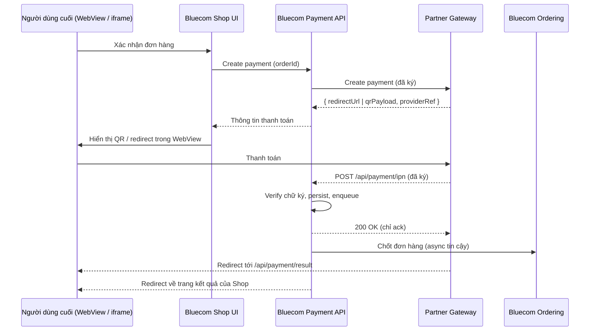

# Kiến trúc

Bluecom tích hợp các payment gateway bên thứ ba thông qua **một abstraction dịch vụ thanh toán duy nhất** trong nền tảng. Gateway của bạn là một implementation đứng sau contract đó — phần còn lại của nền tảng (Ordering, Shop UI, Hub, đối soát) không thay đổi theo từng nhà cung cấp. Provider mới tái sử dụng cùng endpoints, pipeline ký, kho audit, và job đối soát.

## Luồng tổng quan

Hai kênh độc lập mang kết quả về:

| Kênh | Vai trò | Mức độ tin cậy |
|---------|------|-----------------|
| **IPN (server-to-server)** | Nguồn sự thật để chuyển trạng thái đơn hàng. | Có thẩm quyền. |
| **Redirect trình duyệt** (`/api/payment/result`) | Chỉ phục vụ UX — đưa người dùng về Shop. | Không bao giờ dùng để chốt đơn. |

## Gateway của bạn nối vào đâu

Gateway của bạn kết nối với Bluecom qua ba điểm tiếp xúc:

- Một **endpoint create-payment phía đối tác** mà Bluecom gọi đến với request đã ký.
- Một **hosted payment page phía đối tác** (hoặc QR payload) hiển thị cho người dùng cuối bên trong WebView / iframe của Bluecom.
- Một **endpoint IPN do Bluecom sở hữu** (`POST /api/payment/ipn`) và **return URL** (`GET /api/payment/result`) mà bạn gọi ngược lại.

Mọi thứ khác — máy trạng thái đơn hàng, audit log giao webhook, idempotency, đối soát, observability — đều được nền tảng Bluecom cung cấp. Bạn không cần biết module nội bộ của chúng tôi; bạn chỉ cần tôn trọng contract.

Baseline đã được chứng minh cho contract này là tích hợp **NeoPay**. Provider mới đi theo cùng khuôn; Bluecom làm phần adapter — bạn cung cấp spec, credentials, sandbox và hỗ trợ certification.

## Ràng buộc WebView & iframe

Bluecom Shop được render bên trong app đối tác dưới dạng **WebView (mobile)** hoặc **iframe (web)**. Điều này đặt ra các yêu cầu cứng đối với hosted payment page của bạn:

- **Không có `X-Frame-Options: DENY`** và không có CSP `frame-ancestors` chặn các domain của Bluecom. Nếu trang của bạn chỉ chạy được ở top-frame, bạn phải cung cấp chế độ **create-payment server-to-server + QR / deep-link** thay vì iframe.
- **Chỉ HTTPS**, chứng chỉ CA công khai hợp lệ — chứng chỉ self-signed sẽ làm vỡ Android WebView.
- **Không bắt buộc third-party cookies** trong luồng thanh toán. Safari ITP và lộ trình loại bỏ third-party cookies của Chrome sẽ chặn chúng.
- **Hỗ trợ deep-link `returnUrl`** — Bluecom truyền return URL; trang của bạn phải redirect về URL đó khi thành công **và** khi huỷ. Với WebView native, đây có thể là app scheme dạng `bluecomshop://payment-result`.
- **Responsive ưu tiên mobile**, tối thiểu rộng 360 px.
- **Timeout / expiry phải tường minh** trong response của create-payment để Bluecom hiển thị đồng hồ đếm ngược và tự fail các phiên bị bỏ dở.

## Mô hình bảo mật

- **Ký:** HMAC-SHA256 trên một tập trường được tài liệu hoá và có thứ tự, kèm secret dùng chung. RSA chấp nhận được nếu bạn đang dùng sẵn; Bluecom sẽ thích ứng.
- **Chống replay:** IPN phải kèm `timestamp` đơn điệu hoặc `nonce`. Bluecom từ chối IPN cũ hơn 5 phút.
- **Idempotency:** Bluecom khử trùng lặp theo `(providerRef, eventType)`. Bạn có thể retry IPN an toàn — bản trùng được ack nhưng không áp dụng lại.
- **Secrets:** Bluecom lưu `MerchantCode` và `SecretKey` của bạn trong kho cấu hình được mã hoá, hỗ trợ xoay khoá không downtime. Mong bạn cũng hỗ trợ xoay khoá ở phía mình.
